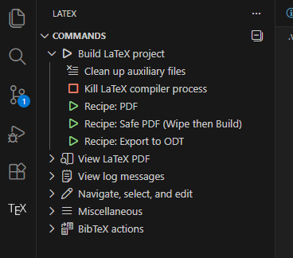

# Latex VSCode template

This template allows you to compile your latex files in a separate folder, keeping your main folder clean. It uses the `latexmk` tool to generate the PDF output. It allows you to generate `.odt` files as well to easily share your work with non-latex people.

## Prerequisites

- Install [VSCode](https://code.visualstudio.com/)
- Install the [LaTeX Workshop](https://marketplace.visualstudio.com/items?itemName=James-Yu.latex-workshop) extension for VSCode
- Install a LaTeX distribution (e.g., [TeX Live](https://www.tug.org/texlive/), [MiKTeX](https://miktex.org/), or [MacTeX](http://www.tug.org/mactex/))
- Install `pandoc` for generating `.odt` files (optional, but recommended)

    - `winget install pandoc` (for Windows)

    - `sudo apt install pandoc` (for Ubuntu/Debian)

- I recommend using a dedicated profile for LaTeX in VSCode to avoid conflicts with other extensions. You can create a new profile by going to `File > Preferences > Profiles` and selecting `Create Profile`. Then, you can install the LaTeX Workshop extension in that profile and switch to it when working on LaTeX projects.

- If you want to use `.svg`images in your LaTeX documents, you will need to install `Inkscape` and add it to your system's PATH. This allows `latexmk` to convert `.svg` files to `.pdf` format during compilation.

    - `[System.Environment]::SetEnvironmentVariable("Path", $env:Path + ";C:\Program Files\Inkscape\bin", "Machine")` (for Windows PowerShell)

## Usage

By default building the project will generate a PDF file that you can open with the previewer.

Go on you `main.tex` file and press `Ctrl + Alt + B` or `Ctrl + S` to build the project. When you are on `.tex` file, the extension will show up on the left side.



You can also generate an `.odt` file by running the `Export to ODT` command from TEX Workshop extension.

The Safe PDF recipe can be used when you have weird behavior with the PDF previewer, it will wipe the output and temp folders before building the project, ensuring a clean build.

## Navigation

Forward Sync (Code to PDF): Put your cursor on a line of text in your .tex file and press `Ctrl + Alt + J`. The PDF should highlight that line.

Backward Sync (PDF to Code): `Ctrl + Left Click` (or double-click depending on your settings) on a word in the PDF. VS Code should jump to that line in your code.

## Files structure

```
.
├── .git/                   # Git tracking data (hidden)
├── .gitignore              # Instructions for Git to ignore temp/output files
├── output/                 # FINAL deliverables (PDF, ODT, etc.)
│   ├── main.pdf            # Compiled document
│   ├── main.odt            # Word-compatible export
│   └── main.synctex.gz     # Link between PDF and Code (for SyncTeX)
├── temp/                   # AUXILIARY files (Compiling "memory")
│   ├── main.aux            # Cross-references and citations
│   ├── main.log            # Compilation messages/errors
│   ├── main.fls            # List of files used in build
│   └── ...                 # Other intermediate files (.4ct, .toc, etc.)
├── figures/                # Image assets used in the document
│   └── diagram.png
├── sections/               # Optional: split long documents into parts
│   ├── intro.tex
│   └── analysis.tex
├── main.tex                # The ROOT LaTeX file
├── references.bib          # Bibliography database
└── README.md               # You are here
```

## Why ODT?

Because going from LaTeX to Word is a nightmare, and the `LaTeX -> ODT -> Word` workflow gives much better results. 